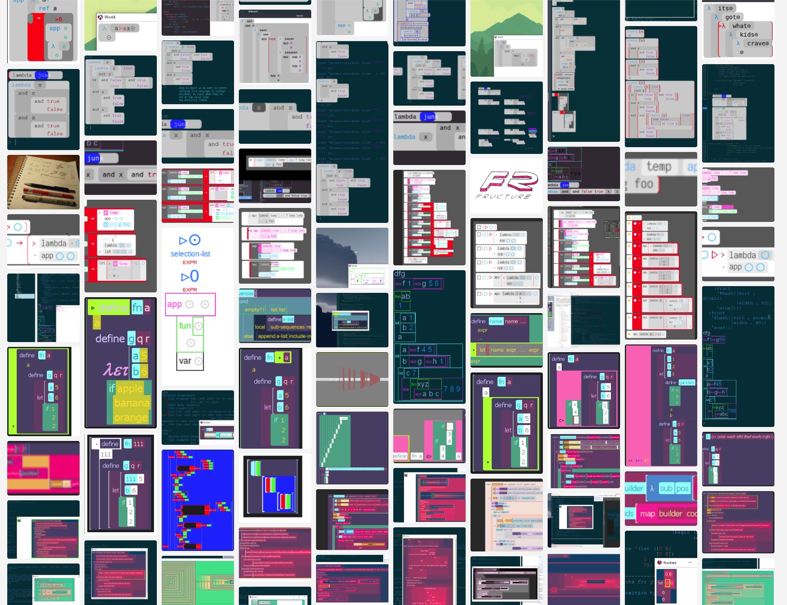

Fructure: A structured interaction engine in Racket
===================================================

Fructure is a personal project where I play with ideas in editing, programming languages, and interaction design.

I wrote a a little bit about my then-current direction in September, just before beginning my current implementation attempt. I've completed most of what I talk about below, with varying levels of success.
- [Fructure 1 of 2](http://disconcision.com/post/182647782084/fructure-1-of-2)
- [Fructure 2 of 2](http://disconcision.com/post/182647803299/fructure-factoring-2-of-2)

Click here to watch a short movie about fructure:

Haha. I wish! Here's a gif though:

Now look at some squares:

For more updates and related content cyberfollow [@twitter](https://twitter.com/disconcision) and [@tumblr](http://disconcision.com/).

[See here](https://fructure-editor.tumblr.com/) for a continuing dev screenshot dump; check out the [chronological overview](https://fructure-editor.tumblr.com/archive).

More screenshots
================

