Fructure: A structured interaction engine in Racket
===================================================

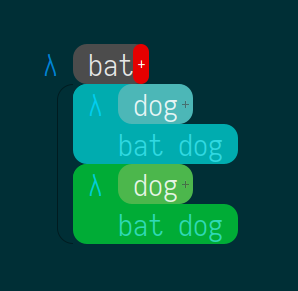

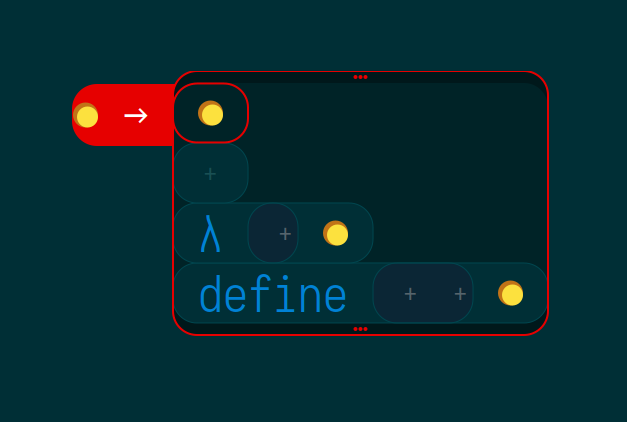

*Updated July 2019*

Fructure is a prototype structure editor, which can currently be used to write & edit small programs in a small subset of scheme/racket. This is a personal project where I'm playing with ideas in editing, programming languages, and interaction design. I'll be speaking about [Fructure at RacketCon 2019](https://con.racket-lang.org/#speakers)! Please enjoy these new scrots:

- **fig 1**: walking the grammar
  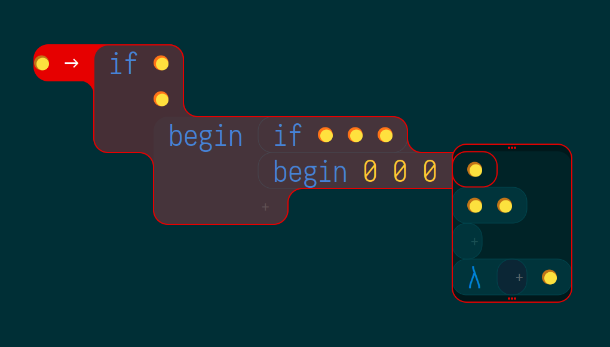

- **fig 2**: refactoring by re/destructuring
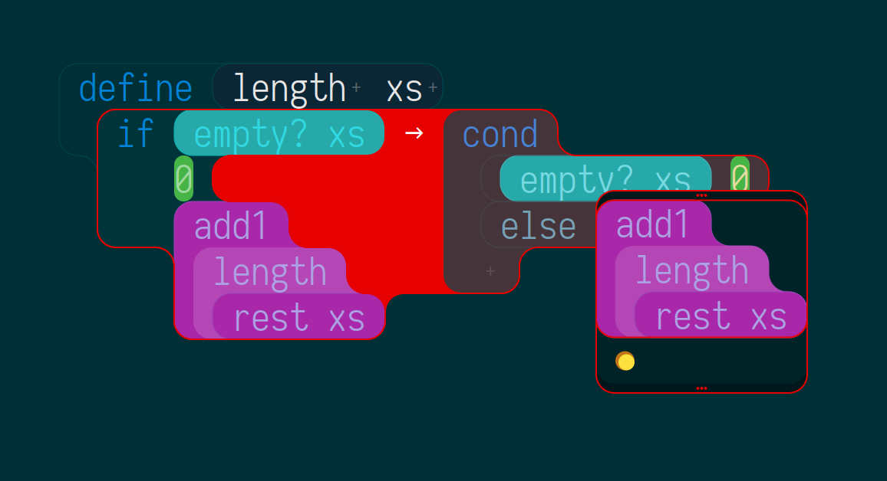

- **fig 3**: menu closeup
  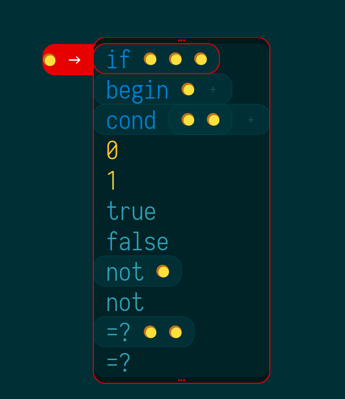

I wrote a bit about my then-current direction in September 2018, just before beginning my current implementation attempt. I've completed most of what I talk about there, with varying levels of success: [Fructure 1 of 2](http://disconcision.com/post/182647782084/fructure-1-of-2) [Fructure 2 of 2](http://disconcision.com/post/182647803299/fructure-factoring-2-of-2). There will soon be some slightly more up-to-date notes via my racketcon slides. For more updates cyberfollow [@twitter](https://twitter.com/disconcision) and [@elsewhere](http://andrewblinn.com/). [Here's an ongoing dev screenshot dump](https://fructure-editor.tumblr.com/); check out the [chronological overview](https://fructure-editor.tumblr.com/archive):

**fig 4**: family history
  

# Installation Instructions

Basically, you need to install racket, a couple libraries, and a font if you don't want thing to look screwy.

**MacOS**:
1. brew cask install racket
2. brew tap caskroom/fonts && brew cask install font-iosevka
3. raco pkg install memoize
3. raco pkg install rackjure
4. git clone https://github.com/disconcision/fructure.git

**Linux, Windows**:
(under construction)

**TO RUN**:
- racket src/fructure.rkt

# Fructure Primer

## STEP 0: What to do if you're stuck / Speedrun instructions
1. How to win: There are modes, but pressing **ESC** enough times should always get you to the base mode. From there, press **SPACE** to enter command mode. From here, PRESS **"q"** then **RIGHT-ARROW** to quit.
2. Check the terminal for silent crashes (aka 'bonus' victory conditions)

## STEP 1: mini tutorial
Fructure starts in NAV(igation) mode. The selector (red) encloses a hole (yellow).

**NAV keybindings**
- `ENTER` toggles TRANSFORM mode

A transform (red) maps the source (the hole) to (->) the target (selection (outlined in red) in menu (also outlined in red))

**TRANSFORM keybindings**
- `UP`/`DOWN` move menu / selector: *find and select an "if" expression)*
- `ENTER` performs selected transform, toggles NAV mode: *transform the hole to the if*

**NAV keybindings (continued)**
- `LEFT/RIGHT` move selector in preorder tree traversal: *go right thrice and left twice to cycle the selection, settling on the first child*

These keys (almost) suffice to build/delete arbitrary syntax, though not terribly conveniently. Build a tiny program this way. I say almost because you can't (yet, owing to a bug) input new identifiers in this way. Doing so (currently) requires being in the menu and pressing **RIGHT** on a lambda or define (see next step).

## STEP 2:
Approximating standard text-entry

**NAV keybindings**
- `UP/DOWN` selector to parent/first child

**TRANSFORM keybindings**
- `ESC` switch to NAV mode without performing transformation
- `RIGHT` step into current transform: (essentially) perform selected transform, and then advance the selector/menu to the first created hole. (unless last action was an undo, in which case RIGHT is a redo)
- `LEFT` undo (back to state at last step, delimited by entering transform mode)
- `SPACE` in current implementation the same as RIGHT, minus the redo part. eventually, it should be part of alphanumerics
- `alphanumerics` + `(` + `)` filter menu by search buffer prefix match
- `BACKSPACE` erase most recent character in search buffer
- `DELETE` erase search buffer

## STEP 3:
Abstract copy/paste

**NAV keybindings**
- `TAB` capture selection
- `ESC` clear captures

**TRANSFORM keybindings**
- `SHIFT`-`LEFT`/`RIGHT` un/fold transform display
- `SHIFT`-`UP`/`DOWN` extend/contract displayed menu options

## STEP 4:
Simple settings scrubber

**NAV keybindings**
- `SPACE` switch to COMMAND mode

**TRANSFORM keybindings**
- `SHIFT-SPACE` switch to COMMAND mode

**COMMAND keybindings**
- `UP/DOWN` select property
- `LEFT/RIGHT` scrub property
- alphanumerics/BACKSPACE/DELETE : filter/unfilter property
- `ESC` return to NAV or TRANSFORM mode

## STEP BOITE DIABOLIQUE: theis houses the 19 forbidden keybindings
EXPERIMENTAL & FICTIONAL
(lies at best, trouble at worst)

**NAV**
- `F2` dump current structure to stdin
- `CTRL`-`F9`-`F12` save structure to disk
- `SHIFT`-`F9`-`F12` load structure from disk
- `SHIFT`-`LEFT`/`RIGHT` selector to sibling
- `DOWN` step into capture
- `alphanumerics` (restrict selector traversal to search buffer hits aka find as you type)
**TRANSFORM**
- `F2` dump current structure to stdin
- `RCTRL` shortcut to select/insert parens

# Screenshots

### Structured insertion via walking the grammar:

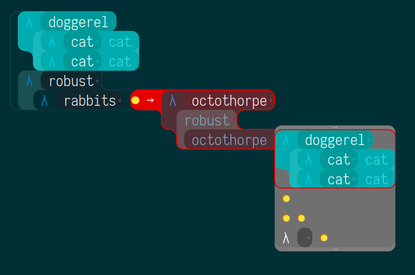

**Click here** to watch a short movie about fructure:

Haha. I wish! Here's a gif though:

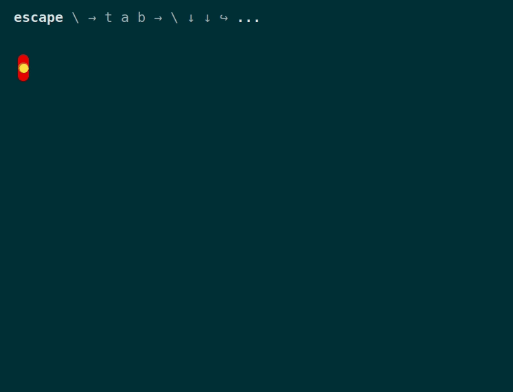

### Navigation mode

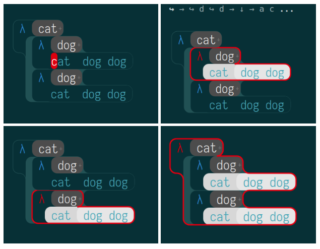

### Copy/Paste via Metavariables

### ...

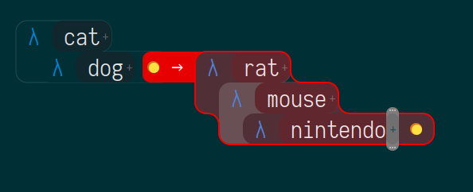
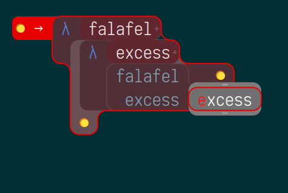
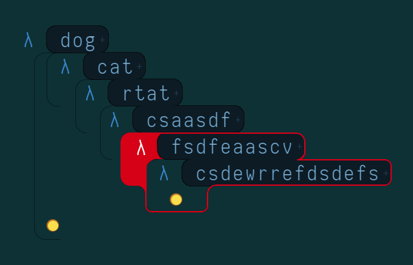
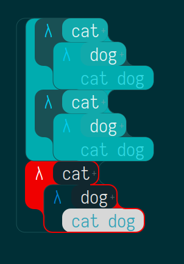
