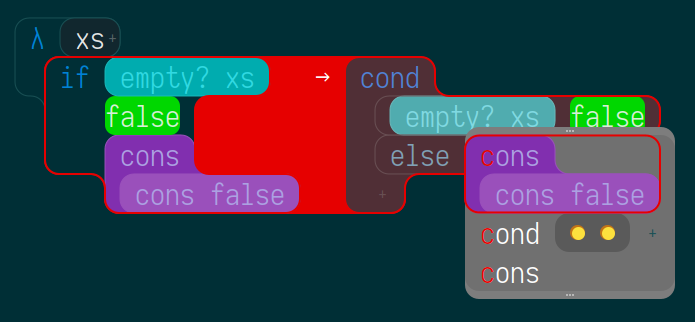
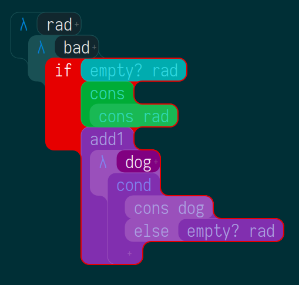

Fructure: A structured interaction engine in Racket
===================================================

Update June 2019:

I'll be speaking about [Fructure at RacketCon 2019](https://con.racket-lang.org/#speakers)! Here are some new screenshots of syntax de/restructuring in action:

Fructure is a personal project where I play with ideas in editing, programming languages, and interaction design.

I wrote a bit about my then-current direction in September, just before beginning my current implementation attempt. I've completed most of what I talk about below, with varying levels of success:
- [Fructure 1 of 2](http://disconcision.com/post/182647782084/fructure-1-of-2)
- [Fructure 2 of 2](http://disconcision.com/post/182647803299/fructure-factoring-2-of-2)

### Structured insertion via walking the grammar:

**Click here** to watch a short movie about fructure:

Haha. I wish! Here's a gif though:

### Navigation mode

### Copy/Paste via Metavariables

### Links

For more updates and related content cyberfollow [@twitter](https://twitter.com/disconcision) and [@tumblr](http://disconcision.com/).

[See here](https://fructure-editor.tumblr.com/) for a continuing dev screenshot dump; check out the [chronological overview](https://fructure-editor.tumblr.com/archive):

### More screenshots

