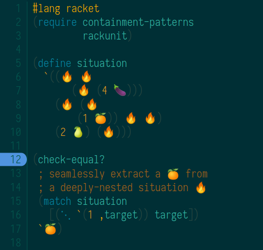

⋱ CONTAINMENT PATTERNS ⋱
=========================




### ⋱ Capture Contexts with Composable Continuations

This library implements several match-expanders which can be used anywhere racket/match pattern-matching is available. `⋱` , `⋱+` , and `⋱1`  are match-expanders which implement containment patterns. These descend into s-expressions to capture arbitrarily deep matches and their multi-holed contexts.


### ⋱ Why

I implemented containment patterns to write concise updates on nested structures for syntax-rewriting purposes in structured-editing and algebraic-stepper prototypes. See [fructure](https://github.com/disconcision/fructure) for an actual use case, or for something simpler, [this toy stepper](https://github.com/disconcision/racketlab/blob/master/choice-stepper.rkt). These are also integrated into [fructerm](https://github.com/disconcision/fructerm).


### ⋱ How

Technically: an *n-holed context* is a captured composable continuation which can be used in a match template as a normal n-ary procedure. These continuations are captured as the pattern-matcher left-to-right preorder-traverses the target looking for matches. 

Explicitly: The pattern `(⋱ <context-name> <pattern>)` binds a procedure to `<context-name>` and a `<match>` to `<pattern>` satisfying `(equal? (<context> <matches>) target)`. `⋱+` is similar, but it binds a list of all matches instead of just the first result, and `⋱1` insists that the match should be unique.

Caveat: If you're using any matchers which have side-effects, note that the inner pattern is evaluated twice for each successful match.


### ⋱ Installation and Usage Instructions

- Execute `raco pkg install git://github.com/disconcision/containment-patterns`
- Add `(require containment-patterns)`
- Insert a `⋱` in Dr. Racket by typing `\ddo` (diagonal dots) and then pressing `alt`+`\`


### ⋱ Usage Examples

See the tests in main.rkt for more examples and additional *secret bonus features* (which may not yet have found their final forms):

1. Check if an item is contained in a nested list:

```racket
(check-true
  (match `(0 (0 1) 2 3)
    [(⋱ 1) #t]))
```

2. Extracting data from a nested context:
```racket
(check-equal?
  (match `(0 (1 zap) 2 3)
    [(⋱ `(1 ,a)) a])
  `zap)
```                

3. Making an update in a nested context:

```racket
(check-equal?
  (match '(0 0 (0 (0 0 (▹ 1)) 0 0))
    [(⋱ context `(▹ ,a))
     (⋱ context `(▹ ,(add1 a))])
  '(0 0 (0 (0 0 (▹ 2)) 0 0))
```

4. Serial substitutions:
(note how `⋱+` is optional in the template; a context is just a function)

```racket
(match '(0 1 (0 1 (1 0)) 0 1)
  [(⋱+ c 1)
   (c 3 4 5 6)])
```

5. Moving a cursor `▹` through a traversal in a nested list of `0`s and `1`s:

```racket
(check-equal?
  (match '(0 1 (0 1 (1 (▹ 0))) 0 1)
    [(⋱+ c (and a (or `(▹ ,_) (? number?))))
     (⋱+ c (match a [`(,x ... (▹ ,y) ,z ,w ...)
                      `(,@x ,y (▹ ,z) ,@w)]))])
  '(0 1 (0 1 (1 0)) (▹ 0) 1))
